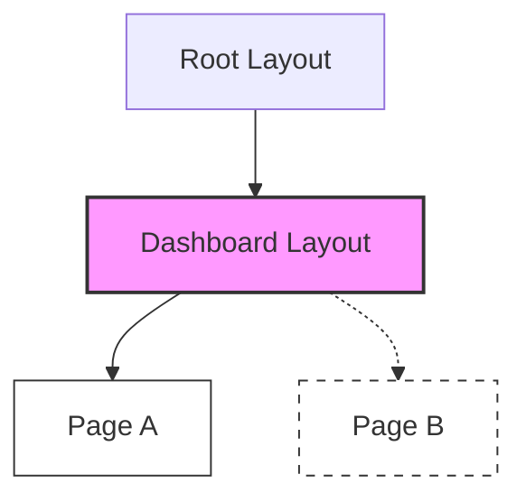

# 演習1-1: 言語化演習 回答

## Q1: layout.tsx と page.tsx の違い

**レンダリングされるファイル:**
A,C,D,

**レンダリングの親子関係（入れ子構造）:**
(A) → (C) → (D)

**説明:**
レイアウトは、レイアウトが配置されたディレクトリと、その配下のサブディレクトリ、すべてのページの大枠を定義することになります。ページはそのディレクトリにおけるページをコンテンツを表示します。なので、Aboutにアクセスした場合、まず大枠としては、App直下のAのレイアウトがまず適用されます。次に、About直下のレイアウトCが適用され、対象のコンテンツとしてDのページが適用されることになります。

---

## Q2: Nested Layout が存在する理由

**再レンダリングの観点からの反論:**
再レンダリングの観点からNestedLayoutを使った方がコンポーネントとしてインポートするよりも好ましいと言えます。コンポーネントとしてインポートした場合、例えばページを切り替えた際にインポートしたコンポーネントは必ずレンダリングされます。ただNestedLayoutを使った場合、そのレイアウト配下のページにおいては、そのレイアウトで配置されているヘッダーをそのまま使い回すことになるので、再レンダリングされることはありません。はい、なのでNestedLayoutを使った方がサイレンダリングの観点から好ましいと言えます。

---

## Q3: layout.tsx の特性

**再レンダリングされるか、されないか:**
結論から述べると、layout.tsx はページ遷移時に「再レンダリング（再マウント）」されません。
同じレイアウトを共有するルート間（例：/dashboard/settings から /dashboard/profile への遷移）では、レイアウト部分は維持され、その中の children であるページコンポーネントのみが差し替わります。

**理由:**
React には Reconciliation（再調和） という仕組みがあります。React はレンダーツリーを比較し、あるコンポーネントの「型」と「ツリー上の位置」が同じであれば、そのコンポーネントのインスタンスを破棄せず、状態（State）を保持したまま再利用します。

/dashboard/a から /dashboard/b に遷移する場合：

Root Layout と Dashboard Layout は、遷移前後でツリー上の位置も型も変わりません。

そのため、React はこれらを「変更なし」と判断し、DOM を壊さず、保持している useState などの内部状態も維持します。

一方、children として渡されている Page 部分のみが入れ替わるため、ここだけが新しくマウントされます。
