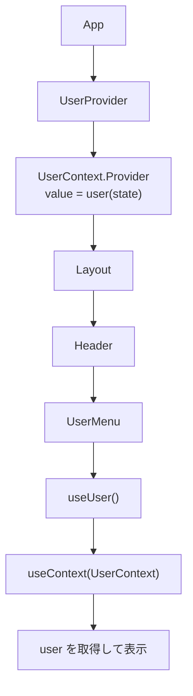

# 設計メモ

## ファイル構成

* App.tsx
  * コンポーネント全体
* UserContext.tsx
  * user情報をコンテキストで管理
  * user情報プロバイダーを用意
  * user情報にアクセスするフックを用意


---

## UserContextの設計

### 型定義

```ts
type User = {
  name: string;
  role: string;
};
```

### UserProviderの責務

User情報をラップしたコンポーネント内でアクセスできるようにすること。

---

## useUserカスタムフックの設計

### エラーハンドリング

```ts
export const useUser = (): User => {
  const user = useContext(UserContext);
  if (user === null) {
    throw new Error("useUser must be used within a UserProvider");
  }
  return user;
};
```

---

## コンポーネント間のデータの流れ



---

## 評価コメント（2026-01-27）

### 設計との整合性
✅ 設計意図と実装が一致しています。ファイル構成、UserProviderの責務、useUserのエラーハンドリングすべて設計通りに実装されています。

### state配置と責務分離
✅ user stateはUserProvider内に適切に配置されています。各コンポーネントの責務も明確に分離されており、propsからuserを削除してContextを通じた取得に変更できています。

### 再レンダリング
✅ 現時点では問題ありません。次の演習（context-pitfalls）で学ぶ内容ですが、userの値が変わるとProvider配下の全コンポーネントが再レンダリング対象になることを認識しておくと良いでしょう。

### 総評
✅ 実装演習は完了です。
